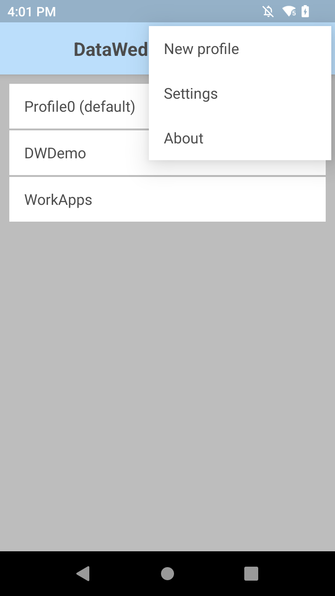

# Expo DataWedge
Add Zebra DataWedge capabilities to your Android based Expo application.

## Installation
**Note:** Expo DataWedge only works with Android devices that support Zebra's DataWedge intent broadcasting. 

### Download
 - Using npm:
    - `npm install expo-datawedge`
- Using yarn:
    - `yarn add expo-datawedge`

### Configure for Expo

In the `app.json` file for your Expo application, you will need to add `expo-datawedge` in the plugins section.

```json
...

"plugins": [
    "expo-datawedge"
]

...
```

### Usage

```ts
import { useEffect } from 'react';
import { Alert, Platform } from 'react-native';

import * as expoDataWedge from 'expo-datawedge';


...

useEffect(() => {
    if (Platform.OS === 'android') {
        expoDataWedge.addScanListener((event) => {
            Alert.alert('Got Scan', JSON.stringify(event));
        })
    }

    return () => {
      
    }
}, []);


...
```


### Testing

Since DataWedge capabilities are not supported natively by the default Expo Go application, you will need to build a packaged development build of your application to test Expo DataWedge. It is recommended to have your Zebra device plugged into your computer with USB debugging enabled as using the Android emulator does not contain the DataWedge application.

- Prebuild your application:

    - `npx expo prebuild`

- Build and run your application:

    - `npx expo run:android`

### Configuring DataWedge

- Create a new DataWedge profile:

    

- Configure DataWedge Profile:

    

    - Set Intent action value to `us.domkalan.expo-datawedge.ACTION`.
    - Set Intent category name to `android.intent.category.DEFAULT`.
    - Set Intent delivery to `Broadcast intent`.
    - Add packaged app name to component information.
        - *Example: If your app is com.example.myapp, select it from the new component popup and enable secure data delivery.*